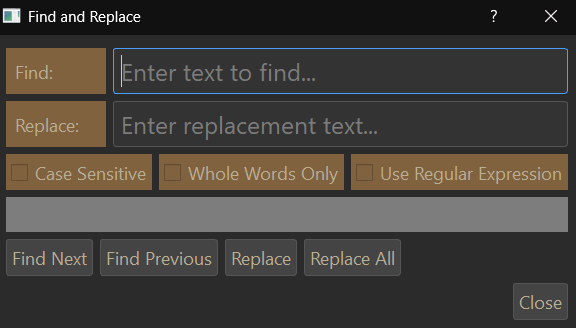
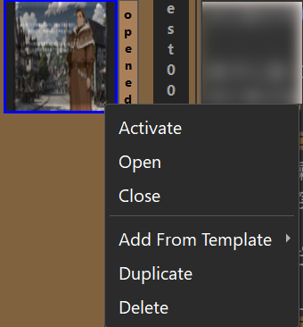
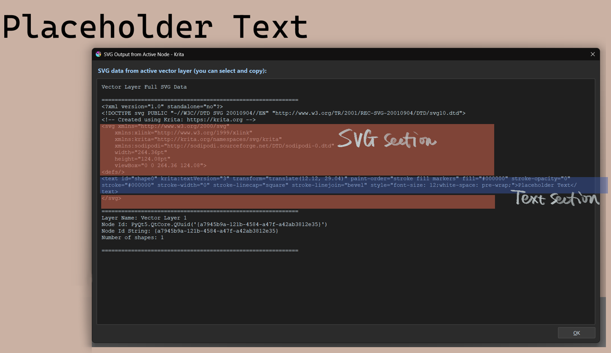

# Krita Story Editor

A tool for editing text layers across multiple Krita documents, whether they are open or closed. Edit all your text content in one place and sync changes back to your files.

**Note:** This tool is designed for Krita 5.3.0, which features a refactored text tool. Currently, Krita 5.3.0 is only available as a pre-alpha version, and its text tool still contains bugs that need to be fixed. This tool may be updated in the future to accommodate changes in the text tool's behavior.

## Demo Video
[](https://youtu.be/eIAFky6YHu4)


## Support

If you find this tool helpful, you can support its development:

[](https://ko-fi.com/toma_omito)

## Architecture


The tool has 3 main parts: the Story Editor for editing text, the Agent running inside Krita that handles document operations, and the Control Tower that connects them together and manages the data flow.

## Components

### Story Editor
The main editing window where you work with text content. It receives text data from the Agent and displays it in editable text boxes.

**Toolbar buttons:**
 

- **Add New Text Widget**  
  The target document must be saved first. Activate your target document by clicking its name bar or thumbnail, then click the Add button to create a new empty text widget at the bottom of that document's section. You can choose a template from the dropdown menu or use the default.

- **Refresh from Krita Document**  
  Click refresh to make the Agent send the latest data to the Story Editor. Use this when you manually edit or move text in Krita, or when you open or close documents.

- **Save All Opened Documents**  
  Saves all currently opened Krita documents.

- **Update Krita**  
  Sends all text data from the Story Editor to the Agent in Krita. The Agent then updates any Krita documents where text has been changed and automatically sends the latest Krita document data back to the Story Editor.
  ##### Only document that has name will be updated. If you create a new document, save it first.

 
- **Find/Replace** 
 

  Opens a popup window for searching and replacing text.

- **Pin Window on Top**  
  Pins the Story Editor window on top of all other windows. 

**Thumbnail:**



Each document's thumbnail is displayed on the left side. Right-click a thumbnail to access document actions:

- **Standard documents:** Activate, open, or close the document.
- **Comic project documents:** Additional options to add new pages using templates, replicate existing pages, or delete pages.

**Text Edit Box:**

In Krita, each text layer is a vector layer containing SVG data. A vector layer can contain one or more text shapes. For example, creating a text in a vector layer produces one shape, while adding another text to the same layer creates a second shape.

The Story Editor creates one text box for each shape in each document. For example, if a Krita document has 2 text layers—one with 2 shapes and another with 1 shape—the Story Editor will display 3 text boxes total.

**Creating multiple shapes:**

When adding new text using "Add New Text Widget", you can create multiple shapes in a single Krita layer by separating them with three line breaks (press Enter three times).

You'll need to select 2 templates when adding new text:
- **SVG Template:** Defines the container structure and document-specific properties
- **Text Template:** Defines the text appearance (font, color, size, etc.)

See the [Templates](#templates) section for more details.

**Deleting text:**

If you remove all text from a text box, the corresponding shape will be deleted from the target layer during the update process. Note that the vector layer itself remains even when all shapes are removed.

**Advanced editing with tspan:**


In later stages of your work, you may want to style parts of the text differently (different color, font size, etc.). These edits place each text section into separate `<tspan>` tags in the SVG. 

The text edit box uses a safe approach: when receiving text data from the Agent, it converts the entire tspan section into raw text. When sending text back to the Agent, it converts the tspan part back into valid SVG data.

You can edit either plain text or tspan data as long as the data is valid. If you know the SVG parameters, you can add tspan tags yourself to change text styles.

**Closed Documents:**
Documents in the selected folder (set via Control Tower) will appear in the Story Editor even when closed in Krita. You can edit existing text in closed documents the same way as opened documents, but you cannot add new text widgets to closed documents.


### Story Editor Agent
A plugin that runs inside Krita. It waits for requests from the Control Tower to perform various tasks, including reading text data from your Krita documents and sending it to the Story Editor, saving documents, closing documents, and more.

When you update text, it writes the changes back to your Krita files.

The Agent includes a button that opens a window displaying the selected vector layer's SVG data, which you can use to create custom template files.

### Story Editor Control Tower


The launcher application that connects everything together.

**Setup steps:**
1. Start Krita and open at least one document to activate the Agent
2. Launch the Control Tower
3. Click "Connect to Agent" to establish the connection
4. Click "Open Story Editor" to start editing

**Additional features:**
- **Set Krita Folder Path** - Select the folder containing your Krita documents. This allows the Story Editor to display and edit documents that are not currently open in Krita.
- **Edit Templates** - Open the template manager to create and modify text templates.
- **Settings** - Configure application settings for the main window, Story Editor, and keyboard shortcuts.

### Templates

Templates are presets for SVG settings used when adding new text widgets. They define how text looks and where it's positioned. If your workflow involves using the same text style repeatedly, templates can save significant time.

#### Template Types

There are two types of templates, each serving a different purpose:

1. **Text Template** - Defines the text appearance (font size, color, styling)
2. **SVG Template** - Defines the container structure and document-specific properties

**Template Structure:**



**Text Template:**
- Controls text appearance including font size, color, and styling parameters
- Each shape in a text layer has a unique ID and text content
- Uses placeholders: `SHAPE_ID` for the shape identifier and `TEXT_TO_REPLACE` for the text content

**SVG Template:**
- Contains document-specific data that varies according to the Krita document's dimensions
- These properties can impact how text is displayed within the document
- Contains the Text section nested inside
- Uses the placeholder `TEXT_TAG_TO_REPLACE` for where the text element will be inserted

When the Story Editor sends updates to the Agent, it automatically replaces these placeholders with the actual shape IDs and text content.

#### Template Manager


The Template Manager allows you to create, edit, and delete templates. To set a default template, right-click a template and select "Mark as Default." New widgets added via "Add New Text Widget" will use the default templates automatically. 

## Installation

### Option 1: Pre-built Releases

**Installing the Agent:**
1. Install the "agent.zip" using krita's Tool - Scripts - Import Python plugin from file

2. After krita starts with agent, run "StoryEditor.exe" for windows or "StoryEditor" for linux.

### Option 2: Manual Build for Linux

If the pre-built Linux executable doesn't work on your system (due to GLIBC compatibility issues), you can build it manually:

1. **Clone the repository:**
   ```bash
   git clone https://github.com/YOUR_USERNAME/krita-story-editor.git
   cd krita-story-editor
   ```

2. **Create and activate virtual environment:**
   ```bash
   cd control_tower
   python3 -m venv venv
   source venv/bin/activate
   ```

3. **Install dependencies:**
   ```bash
   pip install --upgrade pip
   pip install -r requirements.txt
   ```

4. **Build the executable:**
   ```bash
   cd ..
   python scripts/build_executable.py
   ```

5. **Find your build:**
   The distribution package will be in the `scripts\dist` folder
