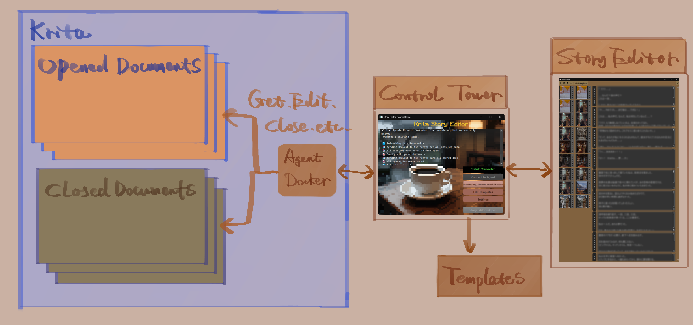
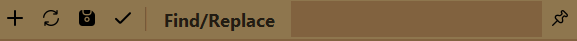
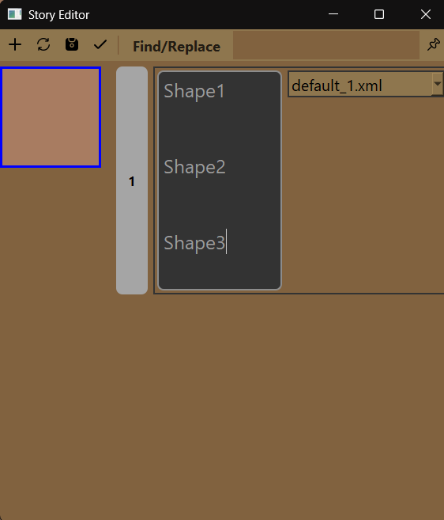
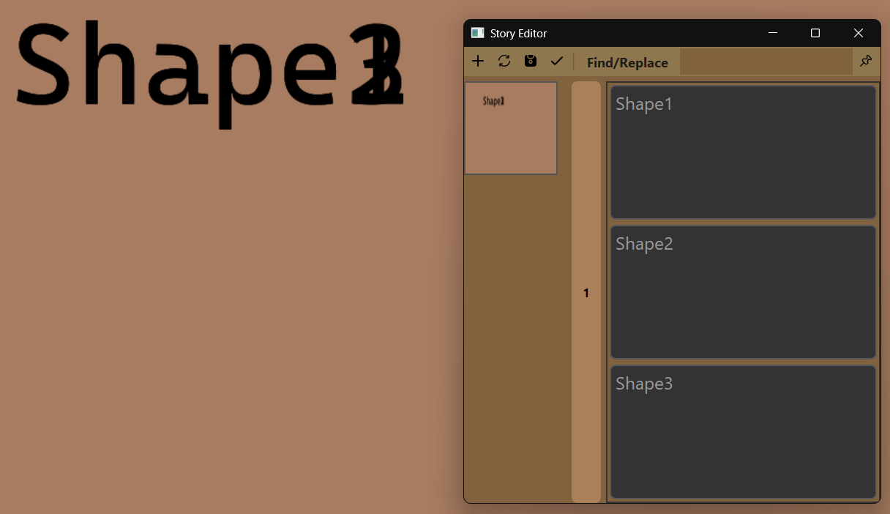
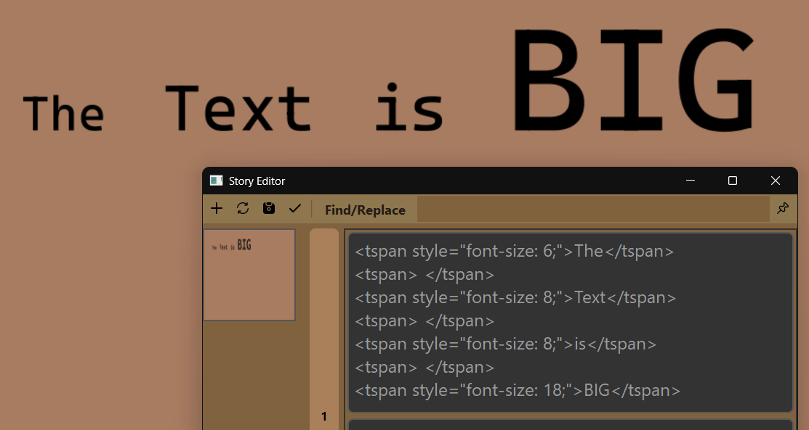
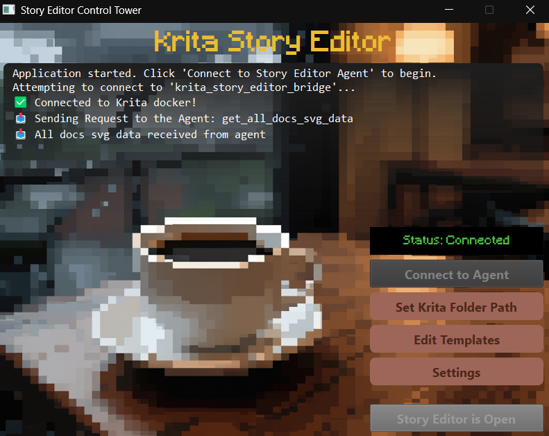
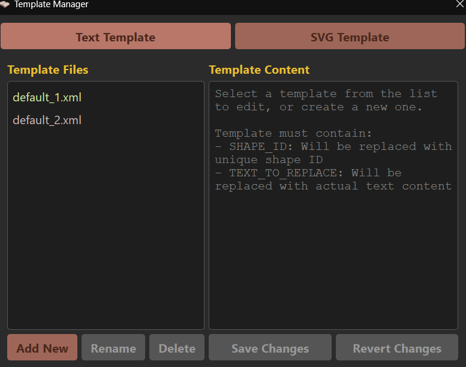

# Krita Story Editor

A tool for editing text layers across multiple Krita documents, whether they are open or closed. Edit all your text content in one place and sync changes back to your files.

## Architecture


The tool has 3 main parts: the Story Editor for editing text, the Agent running inside Krita that handles document operations, and the Control Tower that connects them together and manages the data flow.

## Components

### Story Editor
The main editing window where you work with text content. It receives text data from the Agent and displays it in editable text boxes.

**Toolbar buttons:**


- **Add New Text Widget**  
  The target document must be saved first. Activate your target document by clicking its name bar or thumbnail, then click the Add button to create a new empty text widget at the bottom of that document's section. You can choose a template from the dropdown menu or use the default.

- **Refresh from Krita Document**  
  Click refresh to make the Agent send the latest data to the Story Editor. Use this when you manually edit or move text in Krita, or when you open or close documents.

- **Save All Opened Documents**  
  Saves all currently opened Krita documents.

- **Update Krita**  
  Sends all text data from the Story Editor to the Agent in Krita. The Agent then updates any Krita documents where text has been changed and automatically sends the latest Krita document data back to the Story Editor.

- **Find/Replace**  
  Opens a popup window for searching and replacing text.

- **Pin Window on Top**  
  Pins the Story Editor window on top of all other windows. 

**Text Edit Box:**

In Krita, each text layer is a vector layer containing SVG data. A vector layer can have one or more text shapes. For example, if you create a text in a vector layer, that's one shape. Adding another text to the same layer creates a second shape.

The Story Editor creates one text box for each shape in each document. If a Krita document has 2 text layers—one with 2 shapes and another with 1 shape—the Story Editor will display 3 text boxes.



When adding new text using "Add New Text Widget", you can create multiple shapes in a single Krita layer by separating them with three line breaks (press Enter three times).

**Advanced editing with tspan:**


In later stages of your work, you may want to style parts of the text differently (different color, font size, etc.). These edits place each text section into separate `<tspan>` tags in the SVG. 

The text edit box uses a safe approach: when receiving text data from the Agent, it converts the entire tspan section into raw text. When sending text back to the Agent, it converts the tspan part back into valid SVG data.

You can edit either plain text or tspan data as long as the data is valid. If you know the SVG parameters, you can add tspan tags yourself to change text styles.

**Closed Documents:**

Closed documents in the selected folder (set via Control Tower) will also be displayed in the Story Editor. You can edit existing text the same way as in opened documents, but you cannot add new text widgets to closed documents.

### Story Editor Agent
A plugin that runs inside Krita. It waits for requests from the Control Tower to perform various tasks, including reading text data from your Krita documents and sending it to the Story Editor, saving documents, closing documents, and more.

When you update text, it writes the changes back to your Krita files.

The Agent includes a button that opens a window displaying the selected vector layer's SVG data, which you can use to create custom template files.

### Story Editor Control Tower


The launcher application that connects everything together.

**Setup steps:**
1. Start Krita and open at least one document to activate the Agent
2. Launch the Control Tower
3. Click "Connect to Agent" to establish the connection
4. Click "Open Story Editor" to start editing

**Additional features:**
- **Set Krita Folder Path** - Select the folder containing your Krita documents. This allows the Story Editor to display and edit documents that are not currently open in Krita.
- **Edit Templates** - Open the template manager to create and modify text templates.
- **Settings** - Configure application settings for the main window, Story Editor, and keyboard shortcuts.

### Templates
Templates are presets for SVG settings used when adding new text widgets. They define how the text looks and where it's positioned.

If your workflow involves using the same text style repeatedly, templates can save you a lot of time.

**Template structure:**
```xml
<text id="SHAPE_ID" krita:textVersion="3" transform="translate(40.92, 27.4276171875)" paint-order="stroke fill markers" fill="#000000" stroke-opacity="0" stroke="#000000" stroke-width="0" stroke-linecap="square" stroke-linejoin="bevel" style="inline-size: 45.6;font-size: 14;white-space: pre-wrap;">TEXT_TO_REPLACE</text>
```

Each shape in a text layer has a unique ID. When the Story Editor sends updates to the Agent, it automatically replaces `SHAPE_ID` with a unique identifier and `TEXT_TO_REPLACE` with your actual text content.

#### Template Manager


You can create, edit, and delete templates in the Template Manager. Right-click a template to mark it as the Default Template. Widgets added via "Add New Text Widget" will use the default template initially.

## Installation

**Installing the Agent:**
1. Zip the `agent` folder
2. Install the plugin in Krita using Settings → Manage Resources → Import Bundle
3. After installation, you can delete the `agent` folder

**Running the Control Tower:**
- On Windows: Run `run.ps1`
- On Linux/Mac: Run `run.sh`